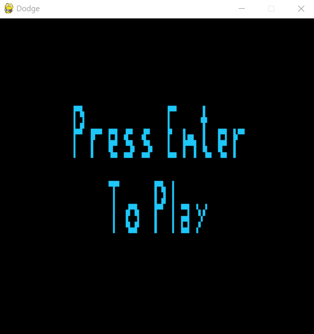
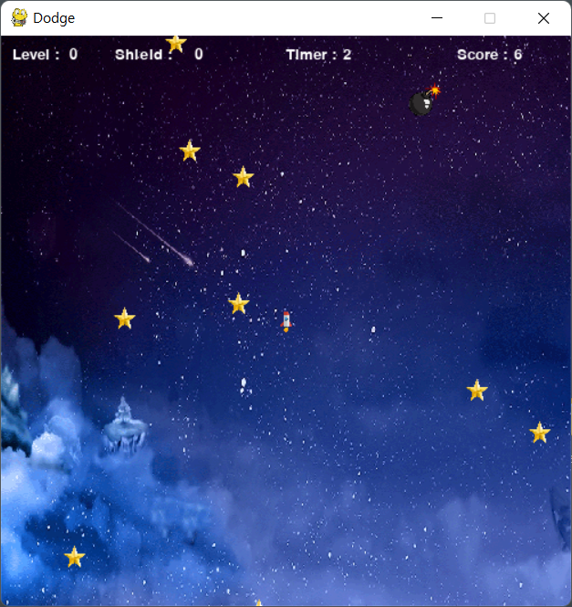
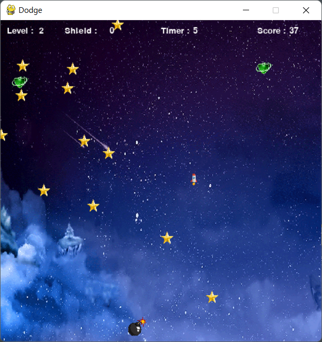
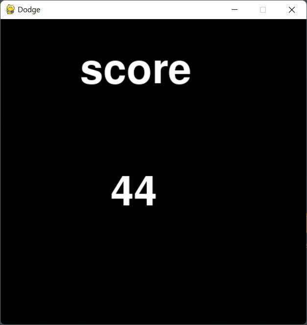

# Open Source Software Term-project

## <닷지게임>

dodge.py 로 실행

python - pygame 라이브러리를 사용하여 제작

## 게임사진

키보드를 눌러 게임시작

게임 플레이 사진
방향키를 이용하여 플레이어 조작

사방에서 별이 생성되며 플레이어와 별이 충돌하면 게임오버

### 아이템

아이템은 10초에 하나씩 생성

아이템(쉴드) - 충돌을 1회 무효화하고 점수 +10

아이템(폭탄) - 현재 화면에 있는 별을 모두 제거하고 점수 + 20

게임 오버 - 아무키나 눌러 재시작

## LICENSE

MIT License

## REFERENCE

**Reference code : (https://m.blog.naver.com/2020xodn/222009846710), pygame 을 이용한 닷지(총알 피하기)**

**Reference image : https://www.pngegg.com/ko , https://www.pngwing.com/ko**

